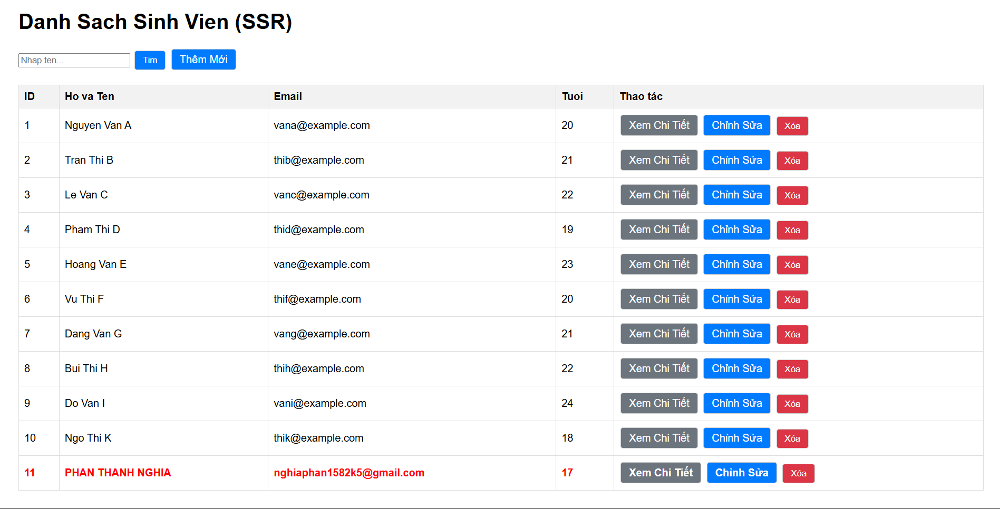
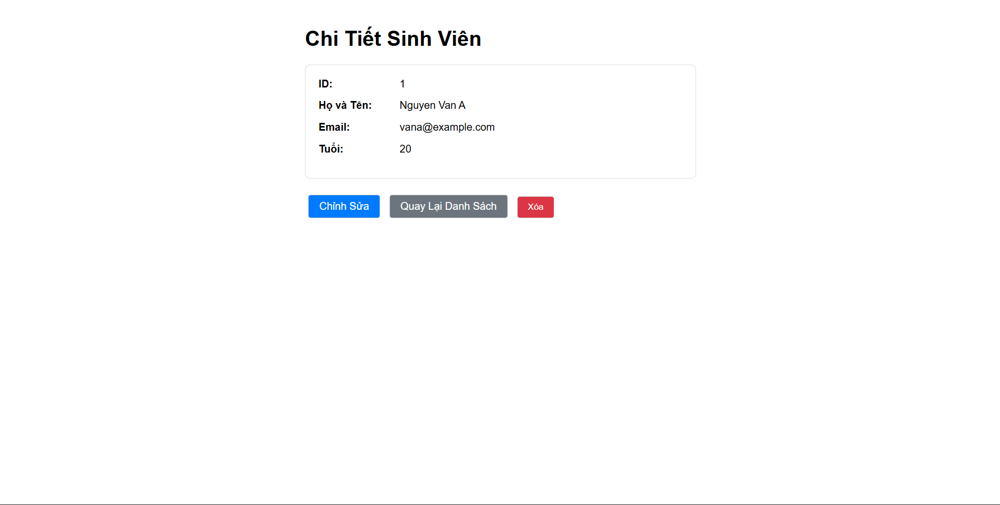
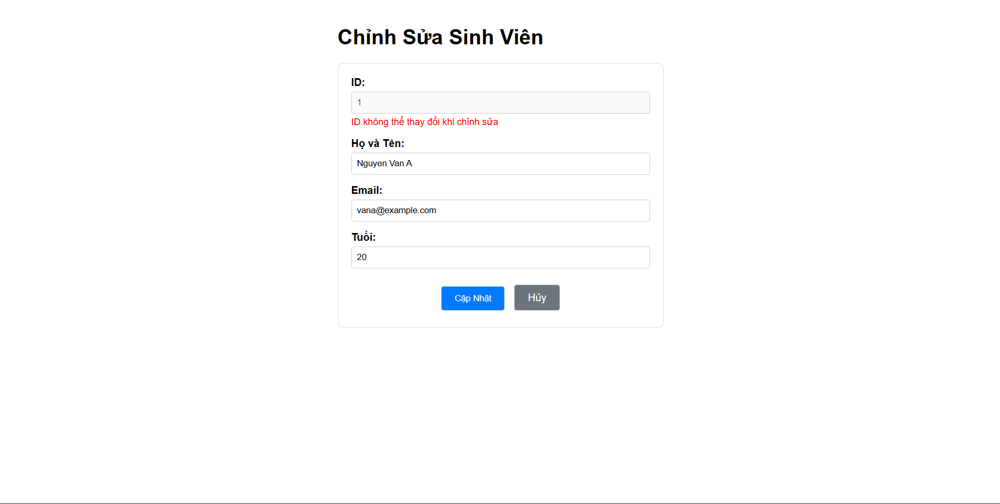

# Student Management System

## 👥 Danh sách nhóm

| MSSV   | Họ và Tên        |
|--------|------------------|
| 2312275 | Phan Thành Nghĩa |

---

## 🌐 Public URL (Deploy trên Render)

👉 https://student-management-system1-x22d.onrender.com/students

---

## 🚀 Hướng dẫn chạy dự án (Local)

### Bước 1: Clone project

```bash
git clone https://github.com/your-username/student-management-system.git
cd student-management-system
```

### Bước 2: Chạy bằng Docker

```bash
docker desktop start
docker build -t student-management .
docker run -p 8080:8080 student-management
```

### Bước 3: Truy cập vào ứng dụng

http://localhost:8080

---

## 📚 Câu trả lời bài tập

### Lab 1:

- Câu 1:

```sql
INSERT INTO students (id, name, email, age)
VALUES
(1, 'Nguyen Van A', 'vana@example.com', 20),
(2, 'Tran Thi B', 'thib@example.com', 21),
(3, 'Le Van C', 'vanc@example.com', 22),
(4, 'Pham Thi D', 'thid@example.com', 19),
(5, 'Hoang Van E', 'vane@example.com', 23),
(6, 'Vu Thi F', 'thif@example.com', 20),
(7, 'Dang Van G', 'vang@example.com', 21),
(8, 'Bui Thi H', 'thih@example.com', 22),
(9, 'Do Van I', 'vani@example.com', 24),
(10, 'Ngo Thi K', 'thik@example.com', 18);
```

- Câu 2:

Nếu insert sinh viên có id trùng:

```sql
INSERT INTO students (id, name, email, age)
VALUES (1, 'Test Student', 'test@example.com', 20);
```

Database báo lỗi:

```terminal
UNIQUE constraint failed
```

Cột id là Primary Key nên phải duy nhất.
Database chặn thao tác này để đảm bảo tính toàn vẹn dữ liệu.

- Câu 3:

Nếu insert sinh viên nhưng để name = NULL:

```sql
INSERT INTO students (id, email, age)
VALUES (21, 'noname@example.com', 20);
```

Database có thể không báo lỗi nếu không có ràng buộc NOT NULL. Ảnh hưởng trong Java:

```java
student.getName().length();
```

➡️ Nếu name = NULL → gây:

```terminal
NullPointerException
```

➡️ Nên đặt:

```sql
name TEXT NOT NULL
```

➡️ Hoặc trong Java:

```java
@NotNull
private String name;
```

- Câu 4:

Nếu mỗi lần restart ứng dụng mà dữ liệu bị mất, nguyên nhân thường là do:

```properties
spring.jpa.hibernate.ddl-auto=create
```

Hibernate sẽ xoá bảng cũ và tạo lại khi khởi động.

➡️Cách khắc phục:

```properties
spring.jpa.hibernate.ddl-auto=update
```

Chế độ này sẽ: Tạo bảng nếu chưa tồn tại, không xoá dữ liệu cũ

### Lab 3:

- 7.1 Chức năng Tìm Kiếm:

🔹Form tìm kiếm

```html
<form action="/students" method="GET">
    <input type="text" name="keyword" placeholder="Nhập tên..." />
    <button type="submit">Tìm</button>
</form>
```
🔹 Controller

Controller được cập nhật để nhận tham số keyword:

```java
@GetMapping
public String getAllStudents(@RequestParam(required = false) String keyword, Model model) {
    List<Student> students;

    if (keyword != null && !keyword.isEmpty()) {
        students = service.searchByName(keyword);
    } else {
        students = service.getAll();
    }

    model.addAttribute("dsSinhVien", students);
    return "students";
}
```

🔹 Service

Thêm phương thức tìm kiếm:

```java
public List<Student> searchByName(String keyword) {
    return repository.findByNameContainingIgnoreCase(keyword);
}
```
🔹 Repository

Spring Data JPA hỗ trợ truy vấn động:

```java
List<Student> findByNameContainingIgnoreCase(String keyword);
```

- 7.2 Hiển Thị Có Điều Kiện:

Hệ thống được cải tiến để làm nổi bật các sinh viên chưa đủ 18 tuổi.

Sử dụng Thymeleaf:

```html
<tr th:each="student : ${dsSinhVien}"
    th:classappend="${student.age < 18} ? 'text-danger' : ''">
    <td th:text="${student.id}"></td>
    <td th:text="${student.name}"></td>
    <td th:text="${student.email}"></td>
    <td th:text="${student.age}"></td>
</tr>
```

## 🖼️ Screenshot Lab 4

### Trang Danh Sách (List View)


### Trang Chi Tiết (Detail View)


### Chức Năng Thêm & Sửa
